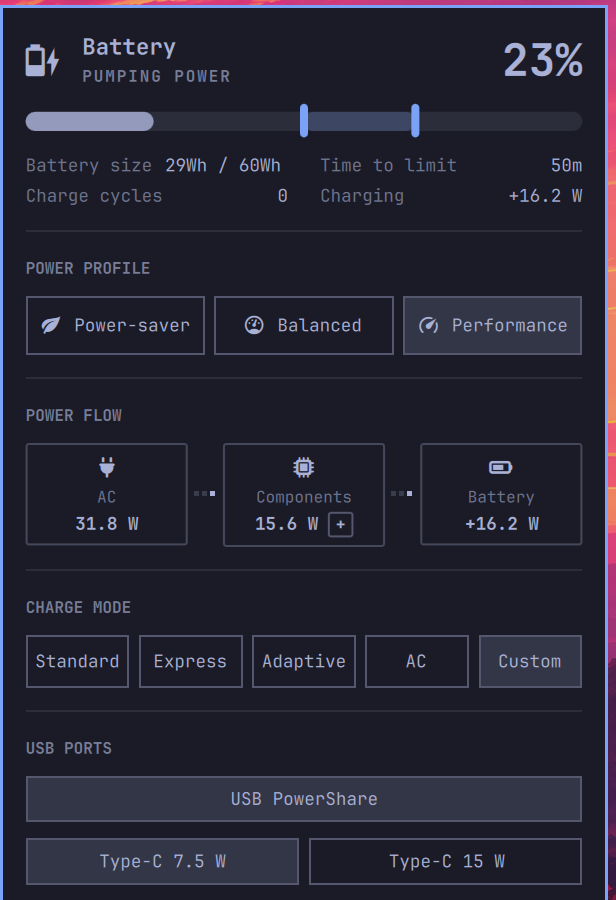

# Dell Power — Omarchy bar widget

Battery status, power profiles, live power flow, and **Dell charge limit
control** for the Omarchy bar. Derived from the built-in `omarchy.power`
widget, extended with charge-limit, charge-mode and power-option controls for
Dell laptops exposed through `dell-smm-hwmon` / `dell-wmi-sysman`
(Latitude 7390 tested).



## Features

- Battery percentage, state, size and cycle count
- AC/battery power profiles (power-profiles-daemon)
- **Power flow chain** — live energy flow with a fixed layout:
  `[Secteur: adapter W] ⇄ [Composants: CPU / iGPU / RAM / Autre] ⇄ [Batterie: ±W]`.
  Animated pixel dots show the flow direction. The adapter tile shows the
  total it provides (RAPL `psys`, which measures the platform *excluding*
  battery charge on this EC, plus the charge power). CPU and RAM come from
  the `package-0` and `dram` RAPL domains; iGPU is deduced as
  package − core − uncore; "Autre" (screen, storage, PCH, fans…) is the
  deduced remainder (composants − CPU − RAM). The breakdown is hidden behind
  the small `+` button on the components tile. The battery always stays on
  the right. On battery, component draw is measured from the battery
  discharge. The battery current sign is corrected from the battery STATE
  (the EC reports unsigned current even while discharging), so a weak USB-C
  adapter that leaves the battery powering the laptop is shown correctly:
  negative battery flow, tiny adapter contribution. The battery tile also
  shows live pack voltage and current (`8.68 V · +1.8 A` — same ±
  convention as the watts). The sampling runs inside the privileged helper
  (`dell-charge-limit power-chain`): the RAPL counters stay root-only and
  the helper returns only 1-second aggregate watts. No helper → the whole
  power-flow section simply stays hidden.
- **Charge limit on the battery bar** — the start/stop thresholds are drawn
  directly on the battery progress bar (accent zone + draggable markers,
  step 5). Dragging a marker switches the charge mode to `Custom`
  automatically; the zone appears dimmed while another mode is active, and
  the hover tooltip explains the state. The helper enforces the firmware
  invariants (start 50–95, stop 55–100, stop ≥ start + 5).
- **Charge mode** — `Standard` / `Express` / `Adaptive` / `PrimAcUse` / `Custom`
  (Long Life Cycle is read-only on the Latitude 7390 — the firmware refuses
  writes — so it is not exposed as a control)
- **USB PowerShare** toggle
- **Type-C connector power** — 7.5 W / 15 W

## Requirements

- Omarchy with the Quickshell plugin system
- A Dell laptop exposing
  `/sys/class/power_supply/BAT0/charge_control_{start,end}_threshold`
  (`dell-smm-hwmon` / `dell_laptop`) and the
  `/sys/class/firmware-attributes/dell-wmi-sysman` interface
- `jq` for the privileged helper
- An Intel CPU for the power-flow chain (RAPL `powercap` counters) — the rest
  of the widget works without it

## Install

1. Add the plugin:

   ```bash
   omarchy plugin add https://github.com/NIPSEN/omarchy-dell-power.git --enable
   ```

2. Install the privileged helper, polkit action and boot cache service:

   ```bash
   cd ~/.config/omarchy/plugins/io.github.nipsen.dell-power
   sudo ./install-system.sh
   ```

3. Restart the shell if it was already running:

   ```bash
   omarchy restart shell
   ```

**Sans l'étape 2**, le widget fonctionne comme un simple indicateur batterie
(pourcentage, stats, profils d'alimentation) et toutes les sections Dell —
charge limit, charge mode, USB, **power flow** — restent cachées, sans erreur
ni prompt. Le panneau affiche alors une section **DELL SETUP** avec la
commande exacte à lancer (cliquer dessus la copie dans le presse-papier) ;
elle disparaît dès que le helper est installé. Le power flow exige le helper
par conception : les compteurs d'énergie RAPL sont en lecture root-only par
défaut du noyau (PLATYPUS / CVE-2020-8694), il n'existe aucun chemin non
privilégié — le helper les échantillonne en root et ne renvoie que des watts
agrégés sur 1 s.

### What install-system.sh installs

| Path | Purpose |
|---|---|
| `/usr/local/bin/dell-charge-limit` | Privileged helper (allowlisted operations only, incl. the power-flow sampler) |
| `/usr/share/polkit-1/actions/io.github.nipsen.dell-power.policy` | polkit action (`auth_admin`, pinned path) — fallback path |
| `/etc/sudoers.d/dell-power` | `NOPASSWD` sudo rule for the installing user, scoped to the helper — primary path |
| `/etc/systemd/system/dell-power-state.service` | Oneshot priming `/run/dell-power/state` at boot |

The installer binds each payload to its reviewed bytes: embedded SHA-256
digests, verified as root (regular file, expected owner, non-writable mode,
digest) before installation, then re-verified on the installed files before
anything is activated.

Reads of thresholds and battery state need no privilege. Writes, and the
power-flow sampling (RAPL counters are root-only by kernel default), run
through `sudo -n /usr/local/bin/dell-charge-limit …`, which needs no password
thanks to the narrow sudoers rule (the helper itself refuses everything
outside its hardcoded allowlist). If the sudoers rule is missing, *writes*
fall back to `pkexec`, which asks for the password via the Omarchy polkit
agent; the power-flow readout stays hidden instead.

## Security notes

- **No world-readable RAPL counters.** Earlier versions shipped a udev rule
  making `energy_uj` world-readable (`0444`) for the power-flow feature. That
  restored the PLATYPUS side channel (CVE-2020-8694) and was removed: the
  helper now samples the counters as root and returns only bounded 1-second
  aggregate watts. Installing this version immediately restores `0400`, as
  does `--uninstall`.
- The sudoers rule grants the installing user passwordless root on the helper
  path only. The helper validates every argument against hardcoded allowlists
  (charge thresholds 50–95/55–100, six WMI attributes with fixed value sets,
  plus the read-only `status` and `power-chain` commands), so the reachable
  surface is exactly what the panel exposes.
- `install-system.sh` never installs bytes it has not verified: each payload
  in the user-writable checkout must match the SHA-256 digest embedded in the
  installer (regular file, correct owner, non-writable, digest match), and the
  installed files are re-hashed before `systemctl enable`.

## Configuration

Inline settings in the widget's `shell.json` bar entry:

```json
{
  "id": "io.github.nipsen.dell-power",
  "showPercentage": false,
  "chargeLimitStep": 5
}
```

- `showPercentage`: show the battery percentage in the bar button. Default: `false`.
- `chargeLimitStep`: amount changed by the − / + buttons. Default: `5`.

## Threshold constraints (firmware-enforced, discovered on the Latitude 7390)

- start: 50–95 %
- end: 55–100 %
- end ≥ start + 5 — the helper adjusts the other bound to preserve this.

## Behavior verified on hardware

| Setting | Applies immediately | Notes |
|---|---|---|
| Charge thresholds (EC) | yes | Stored in the battery EC; effective only in `Custom` mode (the helper switches to it) |
| `PrimaryBattChargeCfg` modes | yes | `PrimAcUse` was observed charging past 90 % on the Latitude 7390 — no reduced cap on this model |
| `UsbPowerShare` | yes | |
| `TypeCPower` | yes | |
| `PeakShiftCfg` | yes | Not exposed in the panel yet |
| `AdvBatteryChargeCfg` | yes | Time windows are BIOS-only on this model; not exposed yet |
| `LongLifeCyclePriBattery` | — | Write refused by the firmware on the Latitude 7390 |
| `PeakShiftBatteryThreshold` | — | Write accepted but not applied by the firmware on the Latitude 7390 |

## Remove

```bash
omarchy plugin remove io.github.nipsen.dell-power
sudo ~/.config/omarchy/plugins/io.github.nipsen.dell-power/install-system.sh --uninstall
```

Removing the plugin does not reset the charge thresholds stored in the
battery EC. Set the values you want before removal, e.g.:

```bash
sudo /usr/local/bin/dell-charge-limit set-end 100
```

## Development

Files under `~/.config/omarchy/plugins/` hot-reload on save. If a change
fails to apply, force a rescan with `omarchy-shell shell rescanPlugins`
(or `omarchy restart shell` as a last resort).

```bash
omarchy plugin validate .
node Model.test.js

# qmllint (fourni par qt6-declarative, hors PATH) — les modules qs.* du shell
# doivent être visibles comme qs/Commons et qs/Ui dans un import path :
mkdir -p /tmp/qmlroot/qs   # /tmp est vidé au reboot — à refaire au besoin
ln -sfn /usr/share/omarchy/shell/Commons /tmp/qmlroot/qs/Commons
ln -sfn /usr/share/omarchy/shell/Ui /tmp/qmlroot/qs/Ui
/usr/lib/qt6/bin/qmllint -I /tmp/qmlroot -I /usr/lib/qt6/qml Panel.qml
# Attendu : uniquement les warnings habituels (missing-property sur bar/Style,
# unqualified access dans les inline components) — aussi présents sur le
# widget omarchy.power d'origine.

qs log -p /usr/share/omarchy/shell --tail 100           # QML errors land here
```

## License

MIT — see LICENSE. The panel's base layout is derived from Omarchy's built-in
`omarchy.power` widget.
